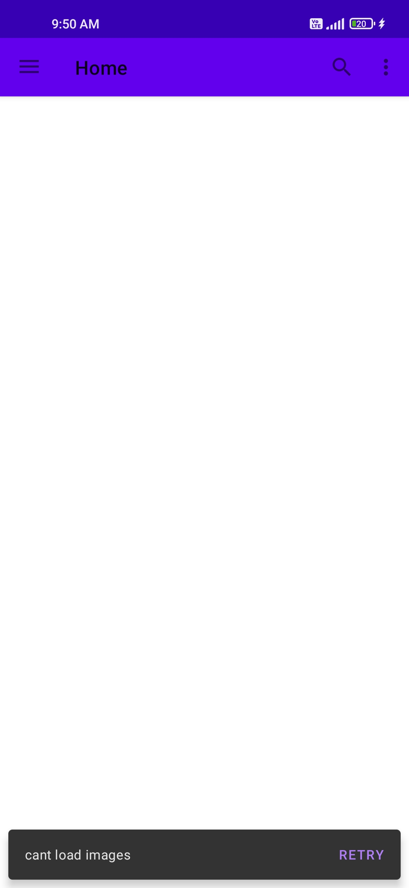

# GalleryApp2
App to display images from flickr api. 

## Features
- MVMM achitechture
- Home page displays recent photos
- Search page to show and search images results.
- Snackbar whenever network failure occurs.
- The loader shows up at the end of the page when pagination calls are going on.
- Navigation Component
- Pagination (paging3)
- Dependency injection with Dagger Hilt.
- Drawer Layout

## Libraries
- paging3
- viewModel
- Dagger hilt
- Retrofit
- Glide
- Navigation
- Coroutines
 

## Result

### Dark Mode
|  |  |  |
|-----------|-------------|-------------|

### Light Mode
|  |  |  |
|-----------|-------------|-------------|
